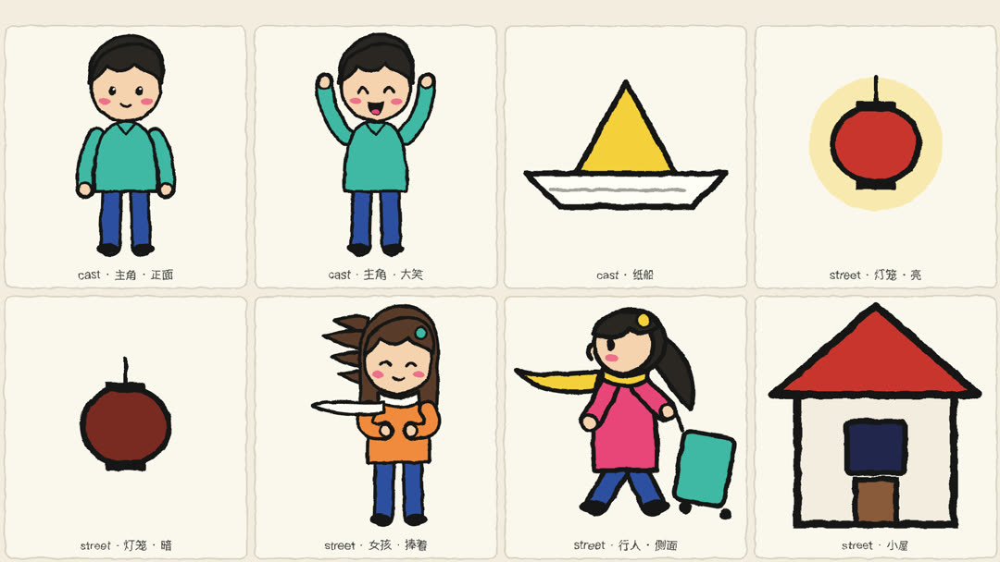

# neo-handdrawn-motion · NEO 手绘动画

逐帧手绘画风的动画技能。目前用来把一首中文歌做成手绘歌词 MV，可以做整首，也可以只做高潮片段；简体、繁体都能出。

- **歌词永远是同一套多彩拼贴打字。** 每一句按唱的节奏逐字打出，写在纸标签、黑缎带、竖排招牌、红对联、黑板菜单、路牌、印章或夜空里；副歌的钩子用大字砸下来。
- **画面每首歌按歌词重新画。** 先读歌词，定这首歌的主角、道具、地点和反复出现的母题，一件件画成素材表给你确认，再拼成镜头。
- **画法统一。** 粗墨线、平涂、线条一直轻轻抖，动作一拍两张。

画面由 Python 生成 SVG，用 [HyperFrames](https://github.com/heygen-com/hyperframes) 合成和渲染。




## 安装

装到当前项目：

```bash
npx skills add neohoy/neo-handdrawn-motion
```

装到全局，并指定给 Claude Code 或 Codex：

```bash
npx skills add neohoy/neo-handdrawn-motion -g -a claude-code
npx skills add neohoy/neo-handdrawn-motion -g -a codex
```

也可以手动克隆到技能目录：

```bash
git clone https://github.com/neohoy/neo-handdrawn-motion ~/.claude/skills/neo-handdrawn-motion
```

### 依赖

这些可以直接让 agent 帮你装。

- Node.js（用 `npx` 运行 HyperFrames）、Python 3、ffmpeg、[uv](https://docs.astral.sh/uv/)（临时装 librosa、fontTools、OpenCC）。
- HyperFrames 的 `music-to-video` 技能，用它分析节拍：

  ```bash
  npx hyperframes skills update music-to-video
  ```

- 中文字体按歌词用字从 Google Fonts 取子集，需要联网。第一次渲染时，HyperFrames 会自己准备渲染用的浏览器。

## 用法

准备两样东西：一首歌，一份带时间的歌词（最好是 LRC）。然后对 agent 说：

```text
用 neo-handdrawn-motion 把这首歌做成手绘歌词 MV，横屏，做整首。歌曲在 [歌曲路径]，歌词在 [LRC 路径]。先读歌词，把意象表、素材表和分镜给我看，先不要画镜头。
```

它会在三个地方停下来等你确认：
1. 意象表、素材表和分镜；
2. 一两个镜头的样片（带音乐）；
3. 渲染前，会告诉你大概要等多久。

成片有原画质、1080p 分享版、720p 手机版三种规格，另附一张转场对照图。

## 里面有什么

```
SKILL.md                 流程、检查点、硬规则（agent 读这个）
references/              歌词转画面、歌词版式、画风规范、镜头配方、全曲规划、动效与避坑
scripts/kit/             typo.py 歌词版式 · draw.py 画法基础件 · scene.py 镜头编排 · 节拍、简繁、字体
scripts/tools/           建工程、节拍分析、歌词导入、素材表、字体子集、找重复副歌、单镜预览、拼接、分段渲染
templates/               镜头模板、素材写法示例、意象表
examples/风吹新竹/        第一支作品的部分镜头脚本和画法，只作参考
```

## 边界

- 只做横屏 1920×1080。
- 画面不放照片。
- 歌词必须带时间，技能还不会自己听歌识别歌词。
- 字体按中文歌配。

## 许可

代码和文档采用 MIT 许可。`assets/fonts/` 里的两款拉丁字体沿用各自的 SIL Open Font License 1.1，说明见 `assets/fonts/LICENSES.md`。
